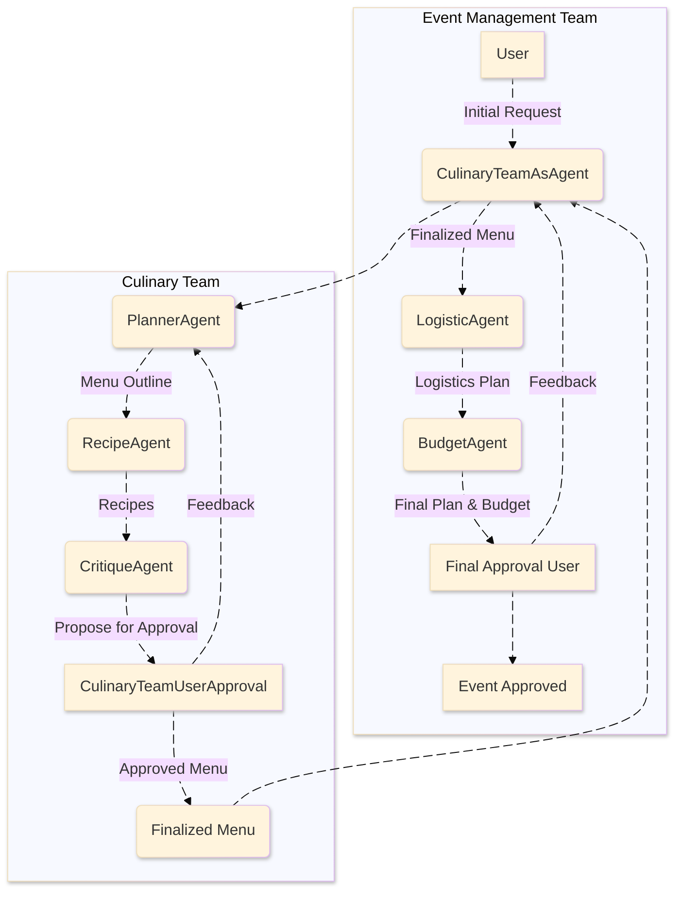

# 🍽️ Multi-Agent Culinary & Event Management System

A two-layer, config-driven multi‑agent application that plans menus, produces recipes, critiques feasibility, then generates logistics and budgets for events. It’s built on **autogen_agentchat** with robust logging and exception handling.

---

## Architecture


---

## Components

### Inner “Culinary Team”
- **PlannerAgent** → interprets user brief and proposes a structured menu.
- **RecipeAgent** → produces detailed recipes and yields.
- **CritiqueAgent** → checks feasibility, conflicts, and consistency; requests revision as needed.
- **CulinaryTeamUserApproval** → interactive user proxy for approval in the inner loop.

### Outer “Event Management Team”
- **CulinaryTeamAsAgent (SocietyOfMindAgent)** → wraps the inner team as a single capability.
- **LogisticAgent** → shopping list, equipment needs, prep timeline & day-of schedule.
- **BudgetAgent** → costs for ingredients and rentals; total budget & assumptions.
- **FinalApproval (UserProxyAgent)** → end-of-pipeline sign-off.

### Termination
- **Inner team**: `TextMentionTermination(stop_word)` ⋁ `MaxMessageTermination(max_message_turns)`  
- **Outer team**: `TextMentionTermination(stop_word)` ⋁ `MaxMessageTermination(max_turns)`

---

## Configuration (YAML)

`config/config.yaml` drives agent names, prompt keys, team members, and termination rules.

```yaml
# General settings for termination
termination:
  word: "APPROVE"
  max_message_turns: 13
  max_turns: 12

# LLM configuration
llm_config:
  openai:
    provider: "openai"
    model_name: "gpt-4o-mini"
    max_tokens: 8192

# Agent configurations
agents:
  # Inner Team Agents
  PlannerAgent:
    name: "PlannerAgent"
    system_message_key: "PlannerAgent" 
    is_user_proxy: false

  RecipeAgent:
    name: "RecipeAgent"
    system_message_key: "RecipeAgent"
    is_user_proxy: false

  CritiqueAgent:
    name: "CritiqueAgent"
    system_message_key: "CritiqueAgent"
    is_user_proxy: false

  # Inner Team User Proxy Agent
  CulinaryTeamUserApproval:
    name: "CulinaryTeamUserApproval"
    system_message_key: "CulinaryTeamUserApproval"
    is_user_proxy: true
    human_input_mode: "ALWAYS" 

  # Outer Team Agents
  CulinaryTeamAsAgent:
    name: "CulinaryTeamAsAgent"
    system_message_key: "CulinaryTeamAsAgent"
    is_user_proxy: false

  LogisticAgent:
    name: "LogisticAgent"
    system_message_key: "LogisticAgent"
    is_user_proxy: false

  BudgetAgent:
    name: "BudgetAgent"
    system_message_key: "BudgetAgent"
    is_user_proxy: false

  # Outer Team User Proxy Agent
  FinalApproval:
    name: "FinalApproval"
    system_message_key: "FinalApproval"
    is_user_proxy: true
    human_input_mode: "ALWAYS"

teams:
  CulinaryTeam:
    name: "CulinaryTeam"
    members:
      - PlannerAgent
      - RecipeAgent
      - CritiqueAgent
      - CulinaryTeamUserApproval

  EventManagementTeam:
    name: "EventManagementTeam"
    members:
      - CulinaryTeamAsAgent
      - LogisticAgent
      - BudgetAgent
      - FinalApproval
```

> Ensure `system_message_key` values exist in your `PROMPT_MESSAGES` map.

---

## Logging & Exceptions

- **Custom Logger**
  - Writes **JSON** logs via `structlog`.
  - Configures AutoGen's **EVENT** (INFO) and **TRACE** (DEBUG) loggers.
  - Creates a timestamped file in `./logs/` per run.

- **Custom Exception**
  - Captures file, line, message, and full traceback.
  - Stringified error is human-readable and log-friendly.

---

## Directory Layout (suggested)

```
.
├─ config/
│  └─ config.yaml
├─ logger/
│  ├─ __init__.py
│  └─ custom_logger.py
├─ exception/
│  ├─ __init__.py
│  └─ custom_exception.py
├─ prompts/
│  └─ system_messages.py
├─ src/
│  ├─ agents/
│  │  ├─ inner_planner_agent.py
│  │  ├─ inner_recipe_agent.py
│  │  ├─ inner_critique_agent.py
│  │  ├─ outer_logistic_agent.py
│  │  ├─ outer_budget_agent.py
│  │  ├─ som_culinary_team_agent.py
│  │  └─ user_proxy.py
│  ├─ team/
│  │  ├─ culinary_team.py
│  │  └─ event_management_team.py
│  └─ models/
│     └─ model_loader.py
└─ utils/
   └─ config_loader.py
```

---

## Quickstart

1. **Install dependencies**
   ```bash
   pip install -r requirements.txt
   ```

2. **Set your LLM credentials**
   ```bash
   export OPENAI_API_KEY=sk-...
   # optionally:
   export LLM_PROVIDER=openai
   ```

3. **Run a demo (outer team)**
   ```bash
   python -m src.team.event_management_team
   ```

4. **Run the inner team only**
   ```bash
   python -m src.team.culinary_team
   ```

---

## Example Task

> “Please plan a menu for a formal dinner party for 30 people. The guests have no dietary restrictions but prefer a menu that includes a mix of textures and flavors.”

The system will:
1) Inner team: Plan → Recipe → Critique → user approve.  
2) Outer team: Logistics → Budget → final user approval.  
3) Produce a structured final report.

---

## Troubleshooting

- **Config path on Windows**: Use `config\\config.yaml` or prefer POSIX `config/config.yaml` for cross‑platform.
- **Missing prompt keys**: Ensure every `agents.*.system_message_key` exists in `PROMPT_MESSAGES`.
- **Terminations not triggering**: Verify `termination.word`, `max_turns`, and `max_message_turns` are set.
- **No logs**: Check that `./logs/` is writable and that the process has permissions.

---

## License

MIT (or your preferred license).
