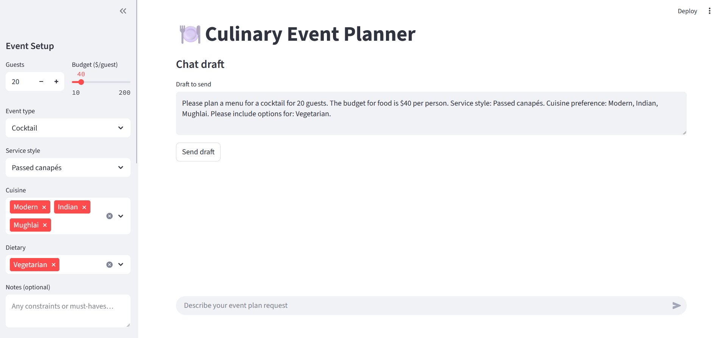
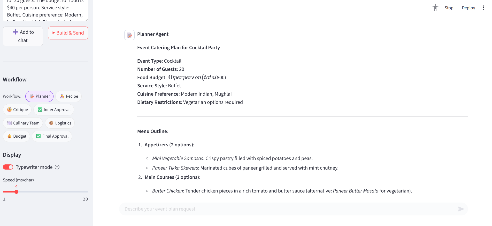
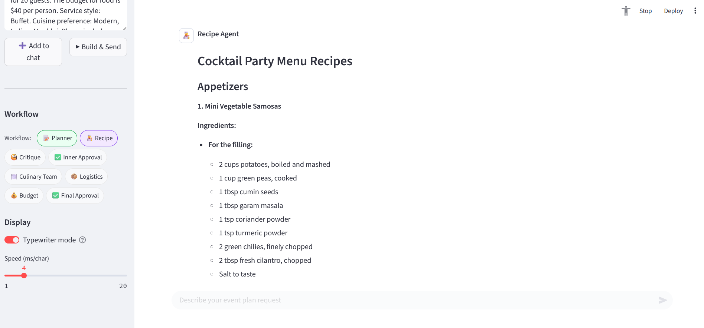
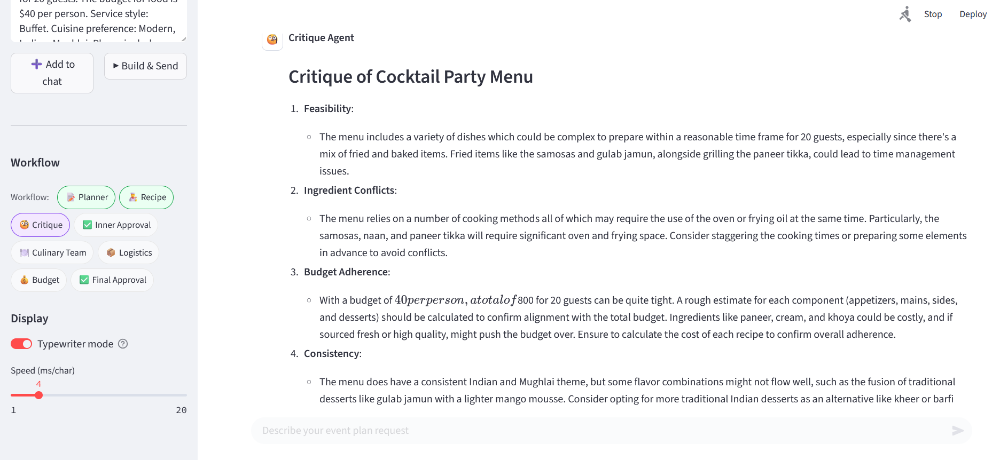

# 🍽️ Multi-Agent Culinary & Event Management System

A two-layer, config-driven multi‑agent application that plans menus, produces recipes, critiques feasibility, then generates logistics and budgets for events. It’s built on **Autogen** with robust logging and exception handling.

---

## Architecture


---

## WorkFlow

### 📋 Event Management Team Workflow

The EventManagementTeam is the main orchestrator a `RoundRobinGroupChat` team of specialized agents working together to plan an event from start to finish.It ensures each part of the process flows smoothly by engaging the right agent at the right time.

1. **Task Initiation** -> It starts with user sharing it's request.
2. **Menu & Recipe Planning** -> The task goes to `CulinaryTeamAsAgent` a SocietyofMind agent that represts the entire culinary team. This team dives deep into creating a menu that fits users event’s style, preferences, and constraints.
3. **Logistics Planning** -> Once the menu is finalized, the LogisticAgent steps in.It turns the menu into a step-by-step action plan, including:
    - A shopping list
    - A preparation timeline
    - An equipment list
4. **Budget Calculation** -> The BudgetAgent takes the logistics plan and calculates the total cost covering ingredients, rentals, and any special equipment.
5. **Final Approval** -> Everything — the menu, logistics, and budget — is handed to FinalApproval (that’s you!) for a last review and sign-off or feedback.

### 👨‍🍳 Culinary Team Workflow

The Culinary Team is a `RoundRobinGroupChat` team, a specialized squad focused entirely on menu and recipe creation. They operate inside `CulinaryTeamAsAgent` and follow their own step-by-step process.

1. **Request from Outer Team** -> The PlannerAgent receives the task from the Event Management Team. Translate users request into a `Structured Menu Outline`.
2. **Recipe Generation** -> The RecipeAgent brings the outline to life with detailed, creative recipes including ingredients, measurements, and instructions.
3. **Critique and Refinement** -> The CritiqueAgent reviews each recipe for feasibility, practicality, and flavor balance. Provides its feedback to the user.
4. **Intermediate User Approval** -> The CulinaryTeamUserApproval agent checks in with the user to Approve the menu and recipies or gather their feedback.
5. **Finalizing the Menu** -> Once the menu and recipies are finalized, it is send back to the `Event Management Team`.

### 🤖 Agent Roles
- **PlannerAgent** → Interprets user brief and proposes a structured menu.
- **RecipeAgent** → Develops full recipes with ingredients, measurements, and steps.
- **CritiqueAgent** → Checks feasibility, conflicts, and consistency; provide feedback to user.
- **CulinaryTeamUserApproval (UserProxyAgent)** → Interactive user proxy for approval in the inner loop.
- **CulinaryTeamAsAgent (SocietyOfMindAgent)** → Wraps the entire Culinary Team into a single agent for the outer team.
- **LogisticAgent** → Shopping list, equipment needs, prep timeline & day-of schedule.
- **BudgetAgent** → Costs for ingredients and rentals; total budget & assumptions.
- **FinalApproval (UserProxyAgent)** → End-of-pipeline sign-off.

### Termination
- **Inner team**: `TextMentionTermination(stop_word)` | `MaxMessageTermination(max_message_turns)`  
- **Outer team**: `TextMentionTermination(stop_word)` | `Max_Turns()`

---
## Output




---

## Configuration (YAML)

`config/config.yaml` drives agent names, prompt keys, team members, and termination rules.

```yaml
# General settings for termination
termination:
  word: "APPROVE"
  max_message_turns: 13
  max_turns: 12

# LLM configuration
llm_config:
  openai:
    provider: "openai"
    model_name: "gpt-4o-mini"
    max_tokens: 8192

# Agent configurations
agents:
  # Inner Team Agents
  PlannerAgent:
    name: "PlannerAgent"
    system_message_key: "PlannerAgent" 
    is_user_proxy: false

  RecipeAgent:
    name: "RecipeAgent"
    system_message_key: "RecipeAgent"
    is_user_proxy: false

  CritiqueAgent:
    name: "CritiqueAgent"
    system_message_key: "CritiqueAgent"
    is_user_proxy: false

  # Inner Team User Proxy Agent
  CulinaryTeamUserApproval:
    name: "CulinaryTeamUserApproval"
    system_message_key: "CulinaryTeamUserApproval"
    is_user_proxy: true
    human_input_mode: "ALWAYS" 

  # Outer Team Agents
  CulinaryTeamAsAgent:
    name: "CulinaryTeamAsAgent"
    system_message_key: "CulinaryTeamAsAgent"
    is_user_proxy: false

  LogisticAgent:
    name: "LogisticAgent"
    system_message_key: "LogisticAgent"
    is_user_proxy: false

  BudgetAgent:
    name: "BudgetAgent"
    system_message_key: "BudgetAgent"
    is_user_proxy: false

  # Outer Team User Proxy Agent
  FinalApproval:
    name: "FinalApproval"
    system_message_key: "FinalApproval"
    is_user_proxy: true
    human_input_mode: "ALWAYS"

teams:
  CulinaryTeam:
    name: "CulinaryTeam"
    members:
      - PlannerAgent
      - RecipeAgent
      - CritiqueAgent
      - CulinaryTeamUserApproval

  EventManagementTeam:
    name: "EventManagementTeam"
    members:
      - CulinaryTeamAsAgent
      - LogisticAgent
      - BudgetAgent
      - FinalApproval
```

> Ensure `system_message_key` values exist in your `PROMPT_MESSAGES` map.

---

## Logging & Exceptions

- **Custom Logger**
  - Writes **JSON** logs via `structlog`.
  - Configures AutoGen's **EVENT** (INFO) and **TRACE** (DEBUG) loggers.
  - Creates a timestamped file in `./logs/` per run.

- **Custom Exception**
  - Captures file, line, message, and full traceback.
  - Stringified error is human-readable and log-friendly.

---

## Directory Layout

```
.
├─ config/
│  └─ config.yaml
├─ logger/
│  ├─ __init__.py
│  └─ custom_logger.py
├─ exception/
│  ├─ __init__.py
│  └─ custom_exception.py
├─ prompts/
│  └─ system_messages.py
├─ src/
│  ├─ agents/
│  │  ├─ inner_planner_agent.py
│  │  ├─ inner_recipe_agent.py
│  │  ├─ inner_critique_agent.py
│  │  ├─ outer_logistic_agent.py
│  │  ├─ outer_budget_agent.py
│  │  ├─ som_culinary_team_agent.py
│  │  └─ user_proxy.py
│  ├─ team/
│  │  ├─ culinary_team.py
│  │  └─ event_management_team.py
│  └─ models/
│     └─ model_loader.py
└─ utils/
   └─ config_loader.py
```

---

## Quickstart

1. **Install dependencies**
   ```bash
   pip install -r requirements.txt
   ```

2. **Set your LLM credentials**
   ```bash
   export OPENAI_API_KEY=sk-...
   # optionally:
   export LLM_PROVIDER=openai
   ```

3. **Run a demo (outer team)**
   ```bash
   python -m src.team.event_management_team
   ```

4. **Run the inner team only**
   ```bash
   python -m src.team.culinary_team
   ```

---

## Example Task

> “Please plan a menu for a formal dinner party for 30 people. The guests have no dietary restrictions but prefer a menu that includes a mix of textures and flavors.”

The system will:
1) Inner team: Plan → Recipe → Critique → user approve.  
2) Outer team: Logistics → Budget → final user approval.  
3) Produce a structured final report.

---

## Troubleshooting

- **Config path on Windows**: Use `config\\config.yaml` or prefer POSIX `config/config.yaml` for cross‑platform.
- **Missing prompt keys**: Ensure every `agents.*.system_message_key` exists in `PROMPT_MESSAGES`.
- **Terminations not triggering**: Verify `termination.word`, `max_turns`, and `max_message_turns` are set.
- **No logs**: Check that `./logs/` is writable and that the process has permissions.

---

## License

MIT (or your preferred license).
